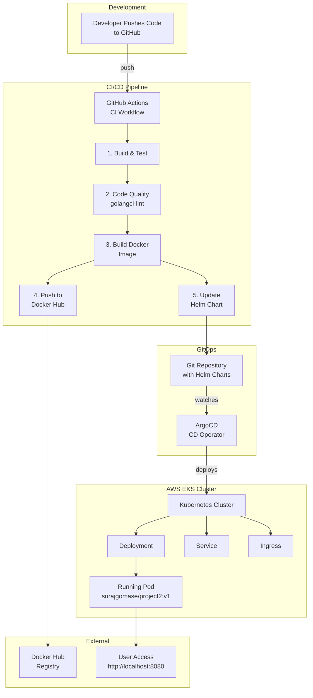
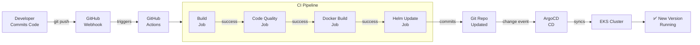
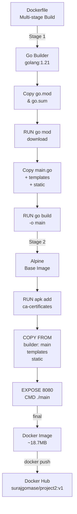
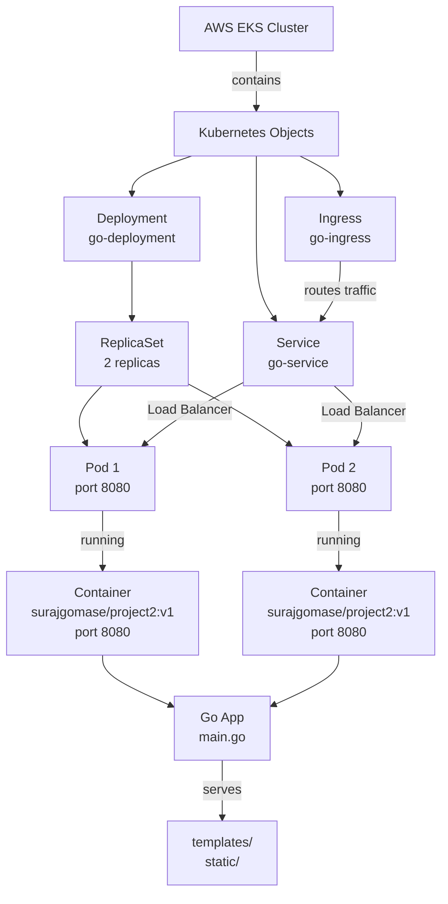
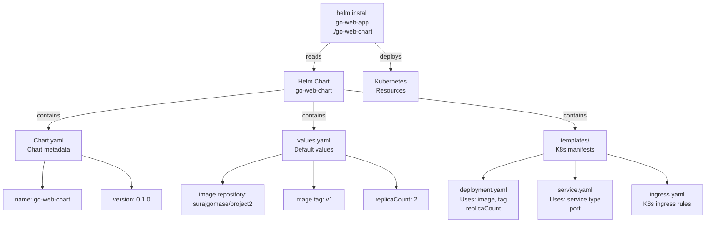
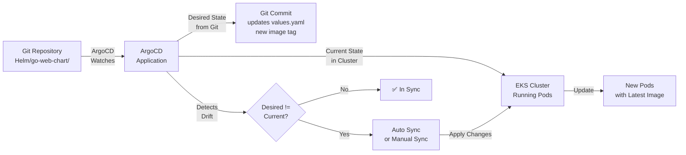
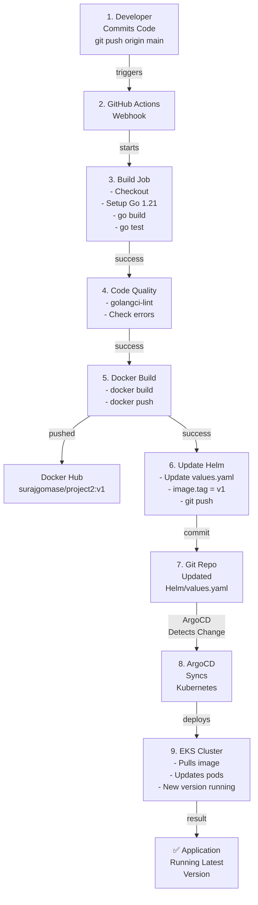
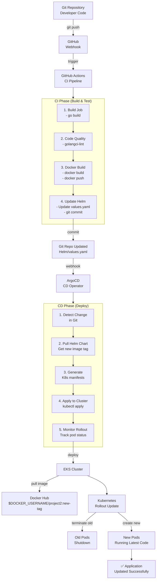

# Project2 Implementation Guide

Complete step-by-step guide for setting up Project2 from scratch.

---

## System Architecture

### Overall Architecture Diagram



### CI/CD Pipeline Flow



### Docker Build Process



### Kubernetes Deployment Architecture



### Helm Chart Structure



### ArgoCD GitOps Flow



### Complete End-to-End Flow



---

## Step 1: Code Analysis

**Objective:** Understand the codebase

- Get code from dev team
- Analyze all code thoroughly
- Check:
  - **Ports** - What port does the app run on? (e.g., 8080)
  - **Language** - What programming language? (e.g., Go 1.21)
  - **Dependencies** - What packages/libraries are used?
  - **Configuration** - Environment variables, configs needed?

**Commands:**
```bash
go mod tidy        # Check dependencies
go build           # Test local build
go test ./...      # Run tests
```

---

## Step 2: Docker Setup

**Objective:** Containerize the application

### 2.1 Write Dockerfile

Create `Dockerfile` in project root:

```dockerfile
# Build stage
FROM golang:1.21-alpine as builder

WORKDIR /app

COPY go.mod go.sum* ./
RUN go mod download

COPY main.go .
COPY ./static ./static
COPY ./templates ./templates

RUN CGO_ENABLED=0 GOOS=linux GOARCH=amd64 go build -o main .

# Final stage
FROM alpine:latest

RUN apk --no-cache add ca-certificates

WORKDIR /root/

COPY --from=builder /app/main .
COPY --from=builder /app/templates ./templates
COPY --from=builder /app/static ./static

EXPOSE 8080
CMD ["./main"]
```

### 2.2 Build Docker Image

```bash
# Set your Docker Hub username
export DOCKER_USERNAME=yourusername
docker build -t $DOCKER_USERNAME/project2:v1 .
```

### 2.3 Test Locally

```bash
docker run -p 8080:8080 $DOCKER_USERNAME/project2:v1
# Visit http://localhost:8080
```

---

## Step 3: EKS Cluster Provisioning

**Objective:** Set up Kubernetes cluster on AWS EKS

### 3.1 Prerequisites

```bash
# Install AWS CLI
aws --version

# Install kubectl
kubectl version --client

# Install eksctl
eksctl version
```

### 3.2 Create EKS Cluster

```bash
eksctl create cluster \
  --name project2-cluster \
  --region us-east-1 \
  --nodegroup-name standard-nodes \
  --node-type t3.medium \
  --nodes 2
```

### 3.3 Verify Cluster

```bash
kubectl get nodes
kubectl get pods -A
```

---

## Step 4: Kubernetes Manifest & Deployment

**Objective:** Deploy application on Kubernetes

### 4.1 Create K8s Manifests

Create `K8s/` folder with three files:

**K8s/Deployment.yml:**
```yaml
apiVersion: apps/v1
kind: Deployment
metadata:
  name: go-deployment
spec:
  replicas: 2
  selector:
    matchLabels:
      app: go-web
  template:
    metadata:
      labels:
        app: go-web
    spec:
      containers:
      - name: go-app
        image: $DOCKER_USERNAME/project2:v1  # Replace with your Docker Hub username
        ports:
        - containerPort: 8080
```

**K8s/Service.yml:**
```yaml
apiVersion: v1
kind: Service
metadata:
  name: go-service
spec:
  selector:
    app: go-web
  type: LoadBalancer
  ports:
  - port: 80
    targetPort: 8080
```

**K8s/Ingress.yml:**
```yaml
apiVersion: networking.k8s.io/v1
kind: Ingress
metadata:
  name: go-ingress
spec:
  rules:
  - host: example.com
    http:
      paths:
      - path: /
        pathType: Prefix
        backend:
          service:
            name: go-service
            port:
              number: 80
```

### 4.2 Deploy on Kubernetes

```bash
kubectl apply -f K8s/Deployment.yml
kubectl apply -f K8s/Service.yml
kubectl apply -f K8s/Ingress.yml
```

### 4.3 Verify Deployment

```bash
kubectl get deployments
kubectl get pods
kubectl get services
kubectl describe pod <pod-name>
```

---

## Step 5: Helm Setup

**Objective:** Package application with Helm for easier management

### 5.1 Install Helm

```bash
# macOS
brew install helm

# Linux
curl https://raw.githubusercontent.com/helm/helm/main/scripts/get-helm-3 | bash
```

### 5.2 Create Helm Chart

```bash
helm create go-web-chart
```

This creates:
```
go-web-chart/
├── Chart.yaml
├── values.yaml
├── templates/
│   ├── deployment.yaml
│   ├── service.yaml
│   └── ...
└── charts/
```

---

## Step 6: Helm Chart Customization

**Objective:** Use K8s manifests in Helm chart

### 6.1 Delete Unnecessary Files

```bash
cd go-web-chart
rm -rf charts/              # Delete charts folder
rm -rf templates/*          # Delete all templates
```

### 6.2 Copy K8s Manifests to Helm Templates

```bash
# Copy your K8s manifests to templates/
cp ../K8s/Deployment.yml templates/deployment.yaml
cp ../K8s/Service.yml templates/service.yaml
cp ../K8s/Ingress.yml templates/ingress.yaml
```

### 6.3 Update Chart.yaml

```yaml
apiVersion: v2
name: go-web-chart
description: A Helm chart for Project2 Go application
type: application
version: 0.1.0
appVersion: "1.0"
```

### 6.4 Update values.yaml

```yaml
# values.yaml
image:
  repository: $DOCKER_USERNAME/project2  # Replace with your Docker Hub username
  tag: "v1"
  pullPolicy: IfNotPresent

replicaCount: 2

service:
  type: LoadBalancer
  port: 80
  targetPort: 8080
```

### 6.5 Modify Templates to Use Variables

Update `templates/deployment.yaml`:

```yaml
image: {{ .Values.image.repository }}:{{ .Values.image.tag }}
replicas: {{ .Values.replicaCount }}
```

---

## Step 7: Deploy with Helm

**Objective:** Install application using Helm chart

```bash
# Install Helm chart
helm install go-web-app ./go-web-chart

# Verify
helm list
helm status go-web-app

# Get pods
kubectl get pods

# Access application
kubectl get svc
```

---

## Step 8: CI/CD Setup with GitHub Actions

**Objective:** Automate build, test, and deployment

### 8.1 Create GitHub Actions Workflow

Create `.github/workflows/ci.yaml`:

```yaml
name: CI

on:
  push:
    branches:
      - main
    paths-ignore:
      - 'docs/**'
      - 'tests/**'
      - 'Helm/**'
      - 'error.md'
      - 'IMPLEMENTATION.md'
      - 'README.md'
      - 'EKS/**'
      - 'GITOPS/**'
      - 'ingress-controller/**'

jobs:
  build:
    runs-on: ubuntu-latest
    steps:
      - name: Checkout code
        uses: actions/checkout@v4

      - name: Set up Go
        uses: actions/setup-go@v4
        with:
          go-version: '1.21'

      - name: Application build
        run: CGO_ENABLED=0 GOOS=linux GOARCH=amd64 go build -o main .

      - name: Run tests
        run: go test ./...

  code-quality:
    runs-on: ubuntu-latest
    needs: build
    steps:
      - name: Checkout code
        uses: actions/checkout@v4

      - name: Set up Go
        uses: actions/setup-go@v4
        with:
          go-version: '1.21'

      - name: Run golangci-lint
        uses: golangci/golangci-lint-action@v6
        with:
          version: v1.59.1

  build-docker-image:
    runs-on: ubuntu-latest
    needs: code-quality
    steps:
      - name: Checkout code
        uses: actions/checkout@v4

      - name: Set up Docker Buildx
        uses: docker/setup-buildx-action@v2

      - name: Docker login
        uses: docker/login-action@v2
        with:
          username: ${{ secrets.DOCKER_USERNAME }}
          password: ${{ secrets.DOCKER_PASSWORD }}

      - name: Build and push Docker image
        uses: docker/build-push-action@v4
        with:
          context: .
          push: true
          tags: ${{ secrets.DOCKER_USERNAME }}/project2:${{ github.run_id }}

  Update_helm_charts:
    runs-on: ubuntu-latest
    needs: build-docker-image
    steps:
      - name: Checkout code
        uses: actions/checkout@v4
        with:
          token: ${{ secrets.TOKEN }}

      - name: Update Helm Chart values.yaml
        run: |
          IMAGE_TAG=${{ secrets.DOCKER_USERNAME }}/project2:${{ github.run_id }}
          sed -i "s|tag: .*|tag: '${IMAGE_TAG##*:}'|g" Helm/go-web-chart/values.yaml

      - name: Commit and Push changes
        run: |
          git config --global user.name "github-actions"
          git add Helm/go-web-chart/values.yaml
          git commit -m "Update Helm chart with new image tag ${{ github.run_id }}"
          git push origin main
```

---

## Step 9: CI/CD Pipeline Explanation

### CI Steps (Continuous Integration)

1. **Build & Unit Test**
   - Checkout code
   - Set up Go 1.21
   - Build application: `go build -o main .`
   - Run tests: `go test ./...`

2. **Static Code Analysis**
   - Run golangci-lint with v1.59.1
   - Check for code quality issues
   - Fail if issues found

3. **Create & Push Docker Image**
   - Build Docker image with Dockerfile
   - Push to Docker Hub with run ID tag
   - Example: `surajgomase/project2:12345`

4. **Update Helm Chart**
   - Pull latest repo
   - Update `Helm/go-web-chart/values.yaml` with new image tag
   - Push changes back

### CD Steps (Continuous Deployment)

1. **Install ArgoCD**
   ```bash
   kubectl create namespace argocd
   kubectl apply -n argocd -f https://raw.githubusercontent.com/argoproj/argo-cd/stable/manifests/install.yaml
   ```

2. **Connect GitOps Repository**
   - Point ArgoCD to your Git repository
   - ArgoCD watches for changes in `Helm/` folder

3. **Deploy on Cluster**
   - ArgoCD detects new Helm chart changes
   - Automatically deploys to EKS cluster
   - Updates running pods with new image

---

## CI/CD Workflow Summary

```
Developer Pushes Code
         ↓
GitHub Actions Triggered
         ↓
Build & Test (Step 1) ✅
         ↓
Code Quality Check (Step 2) ✅
         ↓
Build & Push Docker Image (Step 3) ✅
         ↓
Update Helm Chart (Step 4) ✅
         ↓
Push Changes to Git
         ↓
ArgoCD Detects Changes
         ↓
Deploy to EKS Cluster (CD)
         ↓
✅ Application Running with Latest Code
```

---

## Setup GitHub Secrets

Required secrets for CI/CD to work:

1. **DOCKER_USERNAME** - Your Docker Hub username
2. **DOCKER_PASSWORD** - Your Docker Hub password/token
3. **TOKEN** - GitHub Personal Access Token (for pushing changes)

**How to Add Secrets:**
```
GitHub Repo → Settings → Secrets and variables → Actions → New repository secret
```

---

## Complete Deployment Checklist

- [ ] Code analyzed and understood
- [ ] Dockerfile created and tested locally
- [ ] Docker image built and pushed to Docker Hub
- [ ] EKS cluster provisioned and accessible
- [ ] K8s manifests created (Deployment, Service, Ingress)
- [ ] Helm chart created with custom templates
- [ ] values.yaml configured for image tags
- [ ] Helm chart deployed successfully
- [ ] GitHub Actions workflow file created
- [ ] GitHub secrets configured
- [ ] ArgoCD installed and connected
- [ ] First CI/CD pipeline run successful
- [ ] Application deployed on EKS cluster

---

## Troubleshooting

### Docker Image Not Found on Docker Hub
```bash
docker push surajgomase/project2:v1
```

### Kubernetes Pod Not Starting
```bash
kubectl describe pod <pod-name>
kubectl logs <pod-name>
```

### Helm Chart Update Not Deploying
```bash
helm upgrade go-web-app ./go-web-chart
kubectl rollout restart deployment go-deployment
```

### CI Pipeline Failing
Check `.github/workflows/ci.yaml` syntax and GitHub Actions logs

---

## Step 9: ArgoCD Setup (Continuous Deployment)

**Objective:** Set up GitOps-based continuous deployment with ArgoCD

### 9.1 Install ArgoCD on EKS Cluster

**Step 1: Create ArgoCD Namespace**

```bash
kubectl create namespace argocd
```

**Step 2: Install ArgoCD**

```bash
kubectl apply -n argocd -f https://raw.githubusercontent.com/argoproj/argo-cd/stable/manifests/install.yaml
```

**Step 3: Verify Installation**

```bash
# Check ArgoCD pods
kubectl get pods -n argocd

# Expected output:
# NAME                               READY   STATUS    RESTARTS   AGE
# argocd-application-controller-0    1/1     Running   0          2m
# argocd-dex-server-xxxxx            1/1     Running   0          2m
# argocd-redis-xxxxx                 1/1     Running   0          2m
# argocd-repo-server-xxxxx           1/1     Running   0          2m
# argocd-server-xxxxx                1/1     Running   0          2m
```

### 9.2 Access ArgoCD Server

**Step 1: Get Initial Admin Password**

```bash
# Get admin password (it's the pod name)
kubectl -n argocd get secret argocd-initial-admin-secret -o jsonpath="{.data.password}" | base64 -d; echo
```

**Step 2: Port Forward to Access UI**

```bash
kubectl port-forward svc/argocd-server -n argocd 8443:443
```

**Step 3: Access Web UI**

```
Open browser: https://localhost:8443

Login credentials:
- Username: admin
- Password: <output-from-step-1>
```

**Step 4: Change Admin Password**

```bash
# Login via CLI first
argocd login localhost:8443

# Change password (recommended)
argocd account update-password
```

### 9.3 Configure Git Repository

**Step 1: Create GitHub Personal Access Token**

```
GitHub → Settings → Developer settings → Personal access tokens → Tokens (classic)
- Scope: repo (full control of private repositories)
- Copy the token
```

**Step 2: Add Git Repository to ArgoCD**

```bash
# Via CLI
argocd repo add https://github.com/<YOUR_USERNAME>/Project2.git \
  --username <GITHUB_USERNAME> \
  --password <GITHUB_TOKEN>

# Or via Web UI
# Settings → Repositories → Connect Repo → HTTPS
# - Type: git
# - Repository URL: https://github.com/<YOUR_USERNAME>/Project2.git
# - Username: <GITHUB_USERNAME>
# - Password: <GITHUB_TOKEN>
```

**Step 3: Verify Repository Connection**

```bash
argocd repo list
```

### 9.4 Create ArgoCD Application

**Step 1: Create Application via CLI**

```bash
argocd app create go-web-app \
  --repo https://github.com/<YOUR_USERNAME>/Project2.git \
  --rev main \
  --path Helm/go-web-chart \
  --dest-server https://kubernetes.default.svc \
  --dest-namespace default
```

**Step 2: Or Create Application via YAML**

Create `GITOPS/argocd-application.yaml`:

```yaml
apiVersion: argoproj.io/v1alpha1
kind: Application
metadata:
  name: go-web-app
  namespace: argocd
spec:
  project: default
  source:
    repoURL: https://github.com/<YOUR_USERNAME>/Project2.git
    targetRevision: main
    path: Helm/go-web-chart
  destination:
    server: https://kubernetes.default.svc
    namespace: default
  syncPolicy:
    automated:
      prune: true        # Delete resources no longer in Git
      selfHeal: true     # Auto-sync when cluster drifts
    syncOptions:
      - CreateNamespace=true
```

Apply the application:

```bash
kubectl apply -f GITOPS/argocd-application.yaml
```

**Step 3: Verify Application**

```bash
# Check application status
argocd app get go-web-app

# Or via kubectl
kubectl get applications -n argocd
```

### 9.5 Configure Auto-Sync

**Option 1: Manual Sync (Default)**

```bash
# Manual sync via CLI
argocd app sync go-web-app

# Manual sync via Web UI
# Applications → go-web-app → Sync → Synchronize
```

**Option 2: Automatic Sync**

```bash
# Enable auto-sync
argocd app set go-web-app --sync-policy automated

# Or in YAML (already configured above):
spec:
  syncPolicy:
    automated:
      prune: true
      selfHeal: true
```

With auto-sync enabled:
- ✅ ArgoCD automatically syncs when Git changes
- ✅ ArgoCD automatically fixes cluster drift
- ✅ No manual intervention needed

### 9.6 CD Workflow

**How It Works:**

```
1. Developer pushes code → GitHub
         ↓
2. GitHub Actions CI runs → Builds → Pushes Docker image
         ↓
3. CI updates Helm chart → Pushes to Git (Helm/go-web-chart/values.yaml)
         ↓
4. ArgoCD detects Git change → Pulls new Helm chart
         ↓
5. ArgoCD applies changes → kubectl apply Helm chart
         ↓
6. Kubernetes pulls new Docker image → Updates pods
         ↓
7. ✅ New version running on EKS cluster
```

### 9.7 Useful ArgoCD Commands

```bash
# Get application status
argocd app get go-web-app

# Sync application (manual)
argocd app sync go-web-app

# Check sync status
argocd app wait go-web-app --sync

# Refresh application (fetch latest Git)
argocd app actions run go-web-app refresh

# View application logs
argocd app logs go-web-app

# Delete application
argocd app delete go-web-app

# List all applications
argocd app list

# Get application manifest
argocd app manifests go-web-app
```

### 9.8 Monitoring & Troubleshooting

**Check ArgoCD Logs:**

```bash
# Server logs
kubectl logs -n argocd argocd-server-xxxxx -f

# Application controller logs
kubectl logs -n argocd argocd-application-controller-0 -f

# Repo server logs
kubectl logs -n argocd argocd-repo-server-xxxxx -f
```

**Check Application Status:**

```bash
# Get detailed application info
kubectl describe app go-web-app -n argocd

# Check if synced
argocd app get go-web-app --refresh
```

**Common Issues:**

| Problem | Solution |
|---------|----------|
| App stuck in "OutOfSync" | Run `argocd app sync go-web-app` |
| "Unable to connect repository" | Check Git credentials in ArgoCD settings |
| Pods not updating | Ensure `image.tag` matches in values.yaml |
| ArgoCD pods not running | Check: `kubectl logs -n argocd <pod-name>` |

### 9.9 Complete CD Setup Checklist

```bash
# 1. Install ArgoCD
kubectl create namespace argocd
kubectl apply -n argocd -f https://raw.githubusercontent.com/argoproj/argo-cd/stable/manifests/install.yaml

# 2. Access ArgoCD
kubectl port-forward svc/argocd-server -n argocd 8443:443
# Open: https://localhost:8443

# 3. Login
argocd login localhost:8443

# 4. Add Git repository
argocd repo add https://github.com/<YOUR_USERNAME>/Project2.git \
  --username <GITHUB_USERNAME> \
  --password <GITHUB_TOKEN>

# 5. Create application
argocd app create go-web-app \
  --repo https://github.com/<YOUR_USERNAME>/Project2.git \
  --rev main \
  --path Helm/go-web-chart \
  --dest-server https://kubernetes.default.svc \
  --dest-namespace default

# 6. Enable auto-sync (optional)
argocd app set go-web-app --sync-policy automated

# 7. Verify
argocd app get go-web-app
kubectl get pods  # Should see go-deployment pods running
```

### 9.10 End-to-End Validation

**Test the Complete CD Pipeline:**

```bash
# 1. Make a code change
# Edit main.go or any source file

# 2. Push to GitHub
git add .
git commit -m "feat: test CD pipeline"
git push origin main

# 3. Watch CI pipeline
# GitHub Actions → Actions tab → Watch pipeline run

# 4. Check Helm chart was updated
# GitHub → Helm/go-web-chart/values.yaml → Verify image tag changed

# 5. Check ArgoCD synced changes
argocd app get go-web-app
# Should show "Synced" status

# 6. Verify pods restarted with new image
kubectl get pods
kubectl describe pod <pod-name>
# Check Image: field shows new image tag

# 7. Verify application is running
kubectl port-forward svc/go-service 8080:80
# Open: http://localhost:8080
```

---

## Complete CI/CD Architecture



---

## References

- [Helm Documentation](https://helm.sh/docs/)
- [Kubernetes Documentation](https://kubernetes.io/docs/)
- [GitHub Actions Documentation](https://docs.github.com/en/actions)
- [ArgoCD Documentation](https://argo-cd.readthedocs.io/)
- [EKS User Guide](https://docs.aws.amazon.com/eks/)
- [ArgoCD Getting Started](https://argo-cd.readthedocs.io/en/stable/getting_started/)
- [GitOps Best Practices](https://argo-cd.readthedocs.io/en/stable/operator-manual/best_practices/)
- [EKS User Guide](https://docs.aws.amazon.com/eks/)
